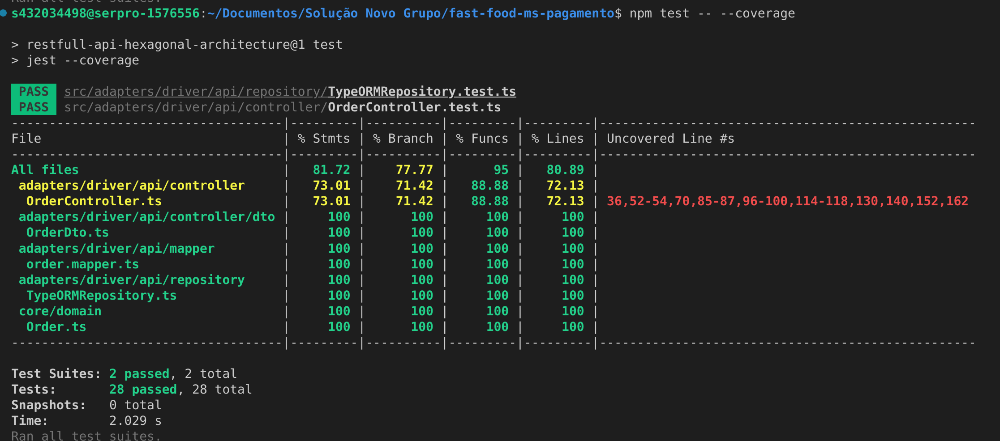

<h1 align="center">Microsserviço para pagamento</h1>


## :sparkles: Funcionalidades ##

:heavy_check_mark: **Fake Checkout:** API para enviar produtos escolhidos para a fila, simulando a finalização do pedido;\
:heavy_check_mark: **Listagem de Pedidos:** API para listar todos os pedidos;\
:heavy_check_mark: **Swagger:** Disponibilização do Swagger para consumo das APIs.


## :rocket: Tecnologias ##

As seguintes ferramentas foram usadas na construção do projeto:


- **TypeScript** e **Node.js** para o desenvolvimento da aplicação.
- **Express** como framework web.
- **Arquitetura Hexagonal** para organização do código.
- **Swagger** para documentação das APIs.
- **Docker** e **Docker Compose** para contêinerização da aplicação.
- **MySQL** como banco de dados.


#### Fluxos Documentados

#### Passos para Execução

1. Clone este repositório para sua máquina local.
   ```bash
   git clone https://github.com/fiap-pos-software-architecture/fast-food-ms-clientes
   cd fast-food-ms-clientes
   ```

2. Configure as variáveis de ambiente. Crie um arquivo `.env` com as seguintes variáveis:
   ```env
    MYSQL_ROOT_PASSWORD=mysql_pagamento
   MYSQL_PASSWORD=jm_password_pagamento
   MYSQL_DATABASE=tech_challenge_BD_pagamento
   MYSQL_USER=jm_user_pagamento
   MYSQL_HOST=mysql-db-pagamento
   MYSQL_PORT=3306
   APP_PORT=3002
   URL_CLIENTES=http://app:3001/customers/
   URL_PRODUTOS=http://app:3002/products/
   ```

3. Compile e construa a aplicação usando Docker.
   ```bash
   docker-compose up --build
   ```

4. Acesse o Swagger para testar as APIs.
   - O Swagger estará disponível em `http://localhost:3002/docs`.

#### Banco de Dados

A aplicação está configurada para utilizar MySQL conforme especificado no arquivo `docker-compose.yml`.

### Cobertura de Testes:


## :memo: Equipe 43

- [Guilherme de Lima](https://github.com/GuilhermeLimaSoares)
- [Jennyffer de Morais](https://github.com/jennyffermorais)
- [Paulo Pupo](https://github.com/devpupo)
- Salomão Pôlegar
- Sabrina Cristina da Silva


&#xa0;

<a href="#top">Voltar para o topo</a>
